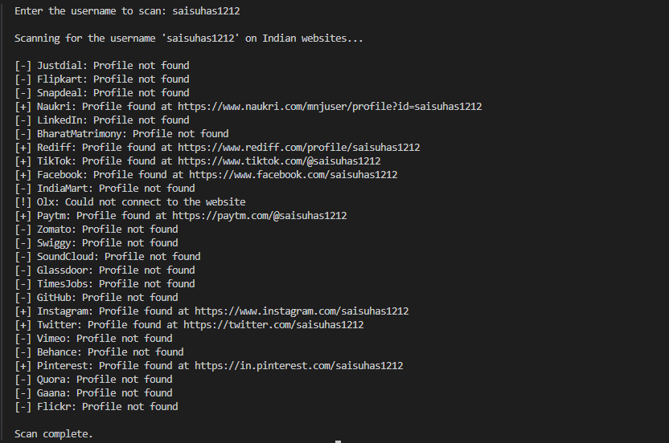

# Cyber Security OSINT Tool

This tool is designed for Open-Source Intelligence (OSINT) to check if a user profile exists on popular Indian websites. It helps in locating social media, professional, and other platform profiles based on a given username.

## Features:
- Scans popular Indian websites for user profiles.
- Multithreaded for faster scanning.
- Checks websites like Instagram, LinkedIn, Flipkart, Naukri, and many more.

## Screenshot



## Installation
1. Clone the repository:
    ```bash
    git clone https://github.com/saisuhas12/Cyber_security_OSINT_tool.git
    ```
2. Navigate to the project directory:
    ```bash
    cd Cyber_security_OSINT_tool
    ```
4. Install the required dependencies:
    ```bash
    pip install -r requirements.txt
    ```

## Usage
- Run the tool:
    ```bash
    python Osint_tool.py
    ```
